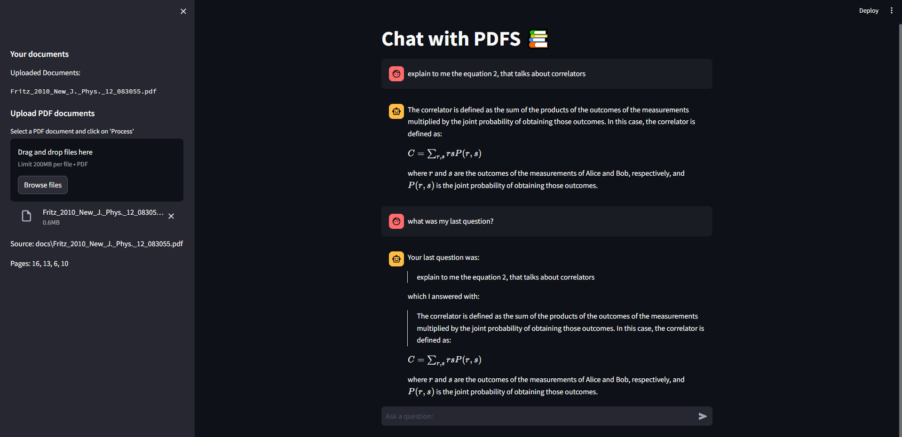

# RAG - ChatBot: Retrieval Augmented Generation (RAG) chatbot using Google's Gemini-Pro model, Langchain, ChromaDB, and Streamlit

This RAG-ChatBot is a Python application that allows the user to chat with multiple PDF documents. You ask questions in natural language, in the same way as if you were to ask a human, and the application will provide relevant responses based on the content of the uploaded documents. This app uses Google's Gemini-Pro model to generate accurate answers to your questions, but the model will only answer questions that are about the uploaded documents.
Here are some key points about the project:
- Upload Documents: When the app is launched, you can upload a PDF document and chat with the document on the fly, no need to reload the app
- Offline Documents: If you need to leave the app, when you come back, you won't need to upload the same document again, you can chat with it as soon as the app starts. Also, you can keep uploading documents to chat with all of them at the same time
- The user interface was crafted with streamlit, with the goal of displaying all necessary information while being extremely simple. The user only has the "upload" button, all the rest is automated by the app
- The model incorporates the chat history, retaining up to 10 users questions and model responses, so if you ask about something and want more details, you can just say "give me more details about that" and the model will know what you are reffering to
- For each response, you can check the source in the sidebar, making sure that the model is not making up responses

## RAG - ChatBot Interface: First Boot and In Usage
The very first time the user launches the app, this will be the screen of the app. Note that the user cannot send any messages, since there are no documents uploaded.


The next time that the user launches the app, the chat box will be available and there will be a list of the uploaded documents. If the user tries to upload the same document again, the "process" button will not appear. When the user asks a question, the model will give a response based on the question, the content that was retrieved from the database, and the chat history. In the image below, we can see that the model is aware of the chat history, and that the source of the answer is displayed in the sidebar.



## How it Works


The main functionality of the app is the loop on the right side of the image. The user asks a question, the app searches for the best response in the database, and the content retrieved from the database is passed to the Large Language Model (LLM), which generates a response based on the question, chat history and content from the database. Here's a more detailed step-by-step of what happens:
1. Upload PDF: If it's the very first time the app is launched, the user will need to upload a document to chat with. The app checks for a folder called "docs", and creates one if it doesn't exist. All PDF documents will be saved into this folder
2. Text Chunking: The app extracts the text from the PDF and separates it into chunks of text, with the size being measured by the limit of tokens the embedding model can handle per chunk
3. Embedding and Saving: These chunks of text pass through an embedding model, that generates vector representations of n dimensions of each text chunk. After that, all vectors are stored in a vector database. In this app, ChromaDB is being used, so that the vectordb is stored in disk, and the app creates a folder called "Vector_DB - Documents", to be the base folder of the database
4. Similarity Matching: When you ask a question, it is appended to the chat history. Also, the text that you used goes through the same embedding model that the chunks did, creating a vector representation of your question. With this, the app compares it with the text chunks and identifies the most semantically similar ones. It does this by using a distance metric, like the cosine similarity, which measures how close the angles between the vectors are. The closer the angles, the higher the similarity between the vectors
5. Response Generation: The selected chunks are passed to the language model, which generates a response based on the relevant content of the PDFs, the user question and the chat history. When the LLM outputs the answer, it is appended to the chat history, so the model can use this to have context of the conversation itself, and not only of the documents, since the chat history is composed of users questions and the models answers

When the app gets initialized and there's already processed documents, steps 1-3 are skipped, and the user can automatically chat with these already processed PDFs. The option to upload a PDF is always available, so when the user does upload a new file, the app does steps 1-3 while a "processing" message appears in the sidebar, and the vector database gets updated with the new document. This way, there's no need for a "manual" mode, where the user can only upload a new file, making the usage of the app easier. 

## App Usage
To install and use the app, an API key from Google will be needed. For this, you can click [here](https://aistudio.google.com/app/apikey). Accept the terms, and if the option to create an API key is not selectable, just reload the page. Click on "Create API Key" and then click on "Create API key in new project" and copy the key. It's recommended to paste the key into a new txt file or something, so you have easy access.
Also, to use the app, it's assumed that you have python installed

### Step 1: Create .env file
Copy this repo or download the files as a zip and extract it. Navigate to the folder where the files README and requirements are located. You will see the app folder too. Create a new txt file and paste this: 

```shell
GOOGLE_API_KEY = "apikey"
```

Now, paste the API key that you generated into the quotation marks. It should look something like this: GOOGLE_API_KEY = "AIzaSyCJOZtTkyN9rfuXEjTtngeubYTUne"

Save the file as an environment file, with .env as the name. To do this, when saving the file, click on Type and choose "Unknown(*.). Make sure that the name of the file is .env

When the file is saved, you should see a file named .env with type "Environment File" in the folder, together with the README and requirements files

### Step 2: Install Packages
Open a terminal in this folder. You can do this by holding the shift key on the keyboard and right-clicking on the screen. An option to open a terminal should appear. In the terminal, write this to install all the requirements for the app:

```shell
pip install -r requirements.txt
```

### Step 3: Run the app
In this same terminal, run this command to startup the app:

```shell
streamlit run app/app.py
```

A new window on your web browser should automatically appear, with the app ready to be used. To stop the app, simply press CTR+C on the terminal. A message of "stopping" will appear, and the app will shutdown
